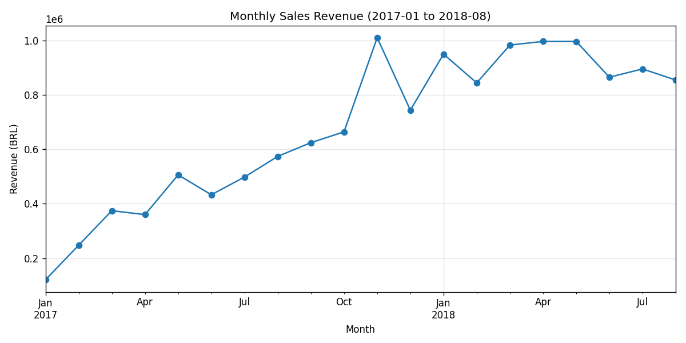
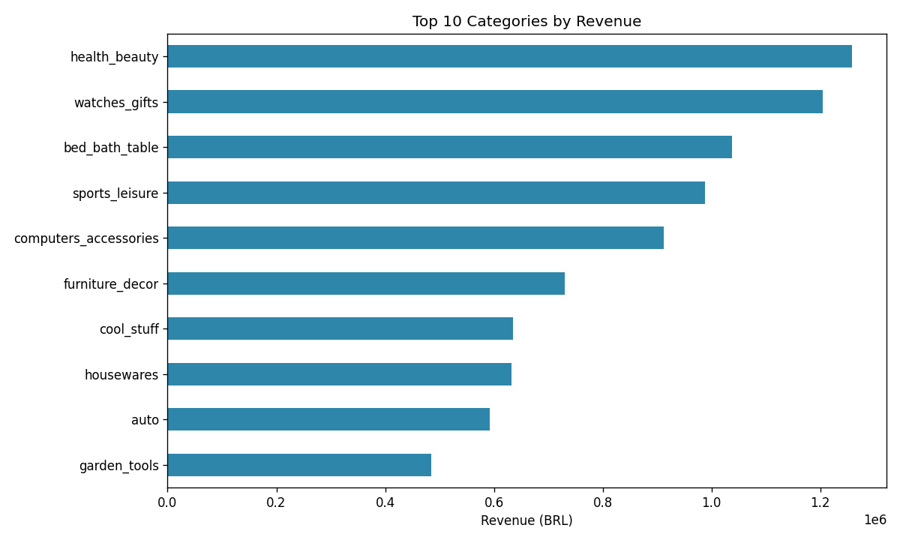
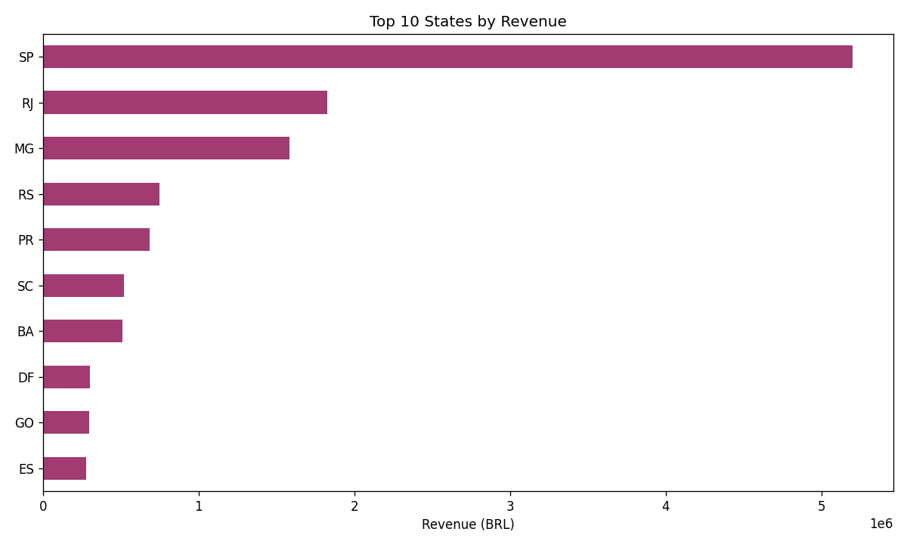
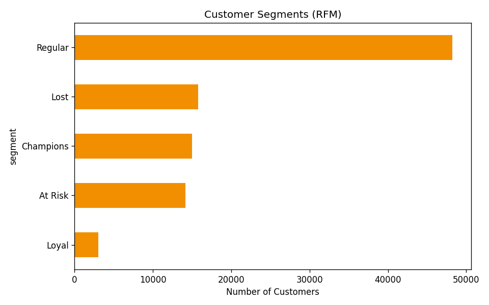
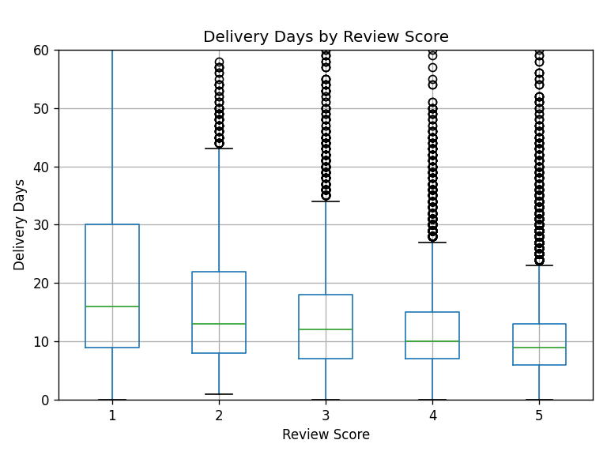

# Olist 电商数据分析报告

**数据周期**：2017年1月 - 2018年8月（剔除数据采集边界不完整月份）
**数据来源**：Olist 巴西电商平台公开数据集，约10万笔订单

---

## 一、项目背景与目标

Olist 是巴西领先的电商聚合平台，连接中小卖家与消费者。本报告基于其公开订单数据，从**业务概览、客户价值、履约体验**三个角度展开分析，目标是识别当前业务的核心特征、潜在风险与可优化方向。

## 二、数据说明

原始数据包含9张关联表（订单、客户、商品、卖家、支付、评价等）。分析前完成了以下处理：

- 按业务粒度拆分为两张主表：**商品级别表**（用于销售/品类分析）与**订单级别表**（用于客户/满意度分析），避免合并不同粒度的表导致重复计算
- 日期字段统一转换格式，计算出配送时长（`delivery_days`）等衍生指标
- 缺失值按业务含义分类处理：未完成订单的缺失配送日期予以保留（真实业务状态），商品类目缺失填充为"unknown"（避免误删有效销售记录）

## 三、业务概览

### 3.1 销售趋势持续增长

2017年至2018年中，月度销售额从约12万雷亚尔增长至接近100万雷亚尔，整体呈稳定上升趋势。2017年11月出现单月峰值（约101万），推测与年末促销活动相关，建议结合具体营销日历进一步验证。

### 3.2 品类与地域高度集中

美妆健康（health_beauty）、手表礼品（watches_gifts）、床上/浴室/餐桌用品（bed_bath_table）是营收贡献最高的三个品类。

圣保罗州（SP）订单量达4.17万笔，是第二名里约热内卢州（RJ，1.29万笔）的3倍以上，业务高度集中于单一区域，存在过度依赖风险，也提示了向其他州拓展的潜在空间。

## 四、客户分层分析（RFM）

采用 Recency（最近购买）、Frequency（购买频次）、Monetary（消费金额）三个维度对客户分层。

**关键提示**：本数据集中 `customer_id` 实际上标识"一次下单行为"而非"一个真实用户"，同一用户多次购买会产生不同的 `customer_id`，必须改用 `customer_unique_id` 才能正确识别复购客户，否则会得出"复购率为0"的错误结论（已通过对比验证确认此问题）。

### 4.1 复购率极低

统计发现，超过75%的客户在平台上只购买过一次，全平台复购率仅 **3.12%**。这是本数据集最突出的业务特征，反映出当前客户运营以获客为主、留存机制较弱。

### 4.2 客户分层结果

| 客户群体 | 人数 | 人均消费(BRL) | 特征 |
|---|---|---|---|
| Regular（普通一次性客户） | 48,199 | 88.57 | 近期或历史消费但非高价值 |
| Lost（低价值已流失） | 15,791 | 38.59 | 长期未购买且消费金额低 |
| Champions（高活跃高价值） | 14,992 | 267.71 | 近期活跃且消费金额高 |
| At Risk（曾高价值现已流失） | 14,117 | **277.75** | 历史消费金额高但已长期未回购 |
| Loyal（回头客） | 2,997 | 259.87 | 购买次数不止一次 |

**核心发现**：At Risk 群体的历史人均消费（277.75）甚至略高于 Champions（267.71），说明这批客户具备较强的付费能力，只是流失了。相比持续投入拉新，**针对 At Risk 群体设计定向召回活动（如专属优惠、复购提醒）**，性价比可能更高。

## 五、配送时效与客户满意度

### 5.1 描述统计

| 评分 | 平均配送天数 | 中位数 | 样本量 |
|---|---|---|---|
| 1星 | 20.85 | 16.0 | 9,409 |
| 2星 | 16.19 | 13.0 | 2,941 |
| 3星 | 13.80 | 12.0 | 7,962 |
| 4星 | 11.85 | 10.0 | 18,987 |
| 5星 | 10.22 | 9.0 | 57,060 |

评分越高，配送时长的分布（均值、中位数、四分位区间）整体越短，呈现出清晰的单调关系。

### 5.2 假设检验

采用 Spearman 等级相关检验（适用于有序分类变量与连续变量的单调关系检验）：

- H0：配送天数与评分之间无单调关系（ρ = 0）
- H1：两者存在单调关系（ρ ≠ 0）
- 结果：**ρ = -0.2344，p < 0.001** → 拒绝原假设，配送时长与满意度评分存在统计显著的负相关关系

**解读需谨慎**：样本量高达96,359，在如此大的样本下即使较弱的相关性也容易达到统计显著。ρ = -0.23 属于弱到中等强度的相关，说明**配送速度是影响客户满意度的因素之一，但并非唯一决定因素**，不宜过度解读为强因果关系。后续可加入商品品类、价格区间等变量做更完整的多因素分析。

## 六、结论与建议

1. **业务持续增长，但高度依赖单一区域市场（SP州）**，建议评估其他州的拓展潜力，分散经营风险
2. **复购率是当前最大的短板**（仅3.12%），相比持续获客，改善复购机制（会员体系、复购券等）可能带来更高的边际收益
3. **At Risk 高价值流失客户是优先召回对象**，其历史消费能力已被验证，召回成本预期低于同等价值的新客获取成本
4. **配送时效与满意度显著相关**，虽非唯一因素，但仍是可优化、见效相对直接的运营抓手，建议重点关注配送时长在15天以上的长尾订单

## 七、分析局限性

- 数据集本身不包含营销活动、价格调整等外部事件记录，部分趋势（如销售峰值）只能推测原因，无法直接验证
- RFM 分层方法基于分位数打分，阈值设定带有一定主观性，可作为业务决策的参考起点，而非唯一依据
- 配送时效与满意度的相关分析未控制商品类型、价格等混杂变量，后续可用多元回归进一步拆解各因素的独立贡献
